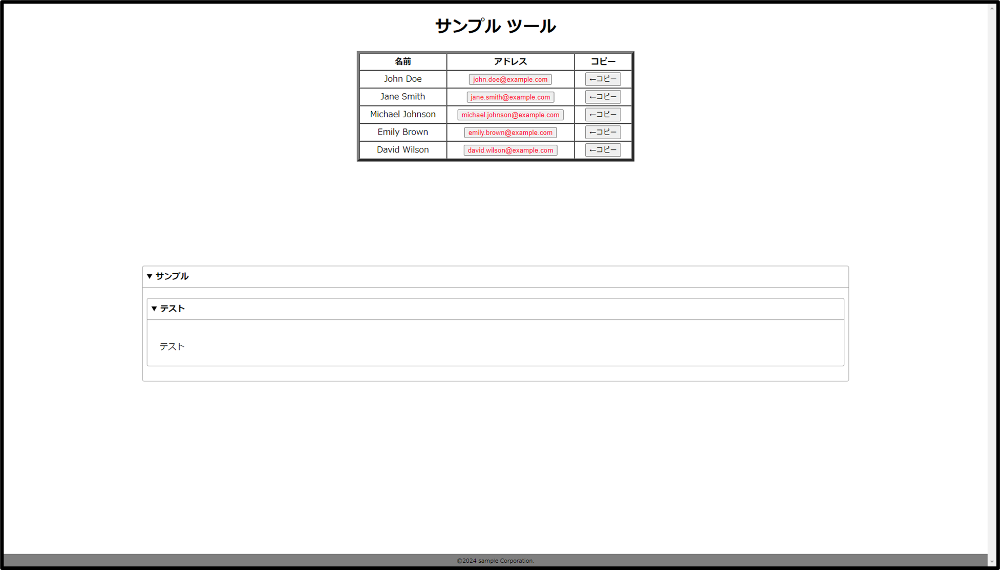

# しえん君

## イメージ



特定のメンバー情報（名前とメールアドレス）を表示し、ユーザーがメールアドレスをクリップボードにコピーできるようにする Web ベースのツールです。
コピー後、指定された URL へのアクセスができるボタンも作成しています。

## 実行方法

ローカルサーバーを立ち上げる必要はありません。<br>
プロジェクトをダウンロードしたディレクトリ内で、index.html のファイルを任意のブラウザで開いてください。

## メンバー追加方法

js\DataTable.js にある member 変数にメンバーの名前とメールアドレスを追加することで使用できるようになります。

```bash
const member = [
  {
    name: 'hoge hoge',
    email: 'hoge@example.com',
  },
]
```

## 作成背景

社内システムにログインする際、メールアドレスなどの入力が面倒でどうにか簡略化できないかを検討しました。
単純にローカルにメモや Excel などを配置すれば解決することはできました。
しかし、何人も利用する共有パソコンだった、そのままのデータを置きたくなかった、
パソコンの性能的に Excel の起動に時間がかかるなどの問題から本ツールを作成するにあたりました。
(といっても本ツールをローカルに置いて運用していましたが)<br>
社内 PC だったこともあり、ローカルサーバーを立ち上げることについても不明点が多かったため、静的ツールを目指して作成しました。

WEB 系技術習得などの目的もありこのようなツールを作成することとなりました。

